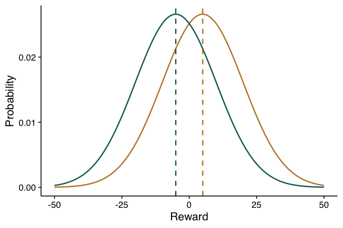

Exploration-exploitation choices and the hot stove effect: a
simulation-based approach
================

## Abstract

To maximize reward when repeatedly choosing among alternatives, humans
build an estimate of each alternative’s value, understood as its
expected outcome. But this creates a dilemma between exploitation, or
making choices in order to reap reward from the alternative whose value
is believed to be highest, and exploration, or choosing in order to gain
information on the value of potentially better alternatives. Some
evidence suggests humans solve such dilemma by choosing very similarly
to softmax algorithms, where value-based choices are combined with a
tendency for exploration controlled by a temperature ($\tau$) parameter.
The present project simulates a series of agents making value-based
choices between two alternatives for reward. By varying the $\tau$
parameter in their softmax, these agents exhibit differences in their
rate of choices of the most rewarding alternative. However, the agents
reaping more reward also underestimate the alternatives’ value to a
greater extent. We explain how this is due to the spontaneous appearance
of the hot stove effect, whereby an alternative delivering an initial
bad outcome prevents further choices of that alternative, leading to an
underestimation of its value. In our context, this creates the
aforementioned dissociation where better value estimates do not
translate into better choices.

## Load libraries and define graphical parameters

Before starting with this project we will load a few R libraries we will
use. Those are mainly dplyr for data wrangling and ggplot2 for data
visualization. Both are part of the collection of packages known as the
tidyverse.

``` r
library(tidyverse)
```

Without any need to talk too much about it, let’s also define a few
graphical parameters that will make our figures more visually appealing.
These include setting sizes and widths for lines, creating a custom
theme, defining our color palettes and. We will also predefine an axis
scale that we will use in most plots.

``` r
#set sizes and widths
axeswidth <- 0.5
size_indivline <- 0.5
size_sumline <- 0.75

#create custom theme
theme_set (theme_classic(14) + theme(axis.line.x = element_line(colour = 'black', linewidth=axeswidth, linetype='solid'),
                                     axis.line.y = element_line(colour = 'black', linewidth=axeswidth, linetype='solid'),
                                     axis.ticks = element_line(color="black", linewidth=axeswidth),
                                     axis.text.x = element_text(color="black"),
                                     axis.text.y = element_text(color="black"),
                                     text = element_text(family = "Helvetica")))

#create color palettes
hue_arm1 <-"#bf812d"
hue_arm2 <- "#01665e"
paltau_color <- scale_color_manual(name = expression("\u03C4"),values =  c("#df65b0","#e7298a","#ce1256","#980043") )
paltau_fill <- scale_fill_manual(name = expression("\u03C4"),values =  c("#df65b0","#e7298a","#ce1256","#980043") )

#set scale for plots using trial as x axis
scalex_trials <-  scale_x_continuous(breaks = c(5, 10, 15, 20, 25), labels = c(5, 10, 15, 20, 25))
```

Finally, we will set a random seed to make our examples reproducible.

``` r
set.seed(986)
```

Okay, without further technical ado, let’s get into the topic.

## Multi-alternative choices and multi-armed bandit tasks

Many daily life situations require us to choose between alternatives for
some sort of outcome or reward. For instance, choosing which pizza joint
to have dinner at. Multi-alternative choice situations have been studied
by disciplines as diverse as computer science, behavioral economics and
cognitive science. In many of their studies and simulations, these
situations are simplified as multi-armed bandit tasks. Analogous to
facing a row of slot machines, or “armed bandits,” in a casino, these
tasks involve agents repeatedly selecting from various options, or
“arms,” with each arm potentially yielding a different reward when
pulled.

For instance, let’s imagine a very simple situation where were have only
two alternatives or arms. When chosen, each of these arms will give
stochastic reward, as an integer, sampled from a Gaussian distribution.
The distribution for one of the arms, that we will call arm 1, will be
centered on a larger mean than the other. The standard deviation (SD)
will be the same. Although this is an arbitrary choice, we will also try
to avoid sampling extreme values, so we will resample any value that is
outside the mean +- three SDs. We can begin setting some parameter
values for mean, SDs and limits.

``` r
#setting mean and SD for each arm's generative distribution
mu_arm1 <- 5 #mean for arm 1
mu_arm2 <- -5 #same for arm 2
sigma_arms <- 15 #SD for both arms

#setting minimum and maximum possible value to be delivered by each arm, corresponding to mean +- 3 SDs
rewcap_up_arm1 <- mu_arm1 + (sigma_arms*3) #upper reward limit for arm 1
rewcap_low_arm1 <- mu_arm1 - (sigma_arms*3) #lower reward limit for arm 1
rewcap_up_arm2 <- mu_arm2 + (sigma_arms*3) #same as above, for arm 2
rewcap_low_arm2 <- mu_arm2 - (sigma_arms*3) #same as above, for arm 2
```

We can then define a function that generates a number of samples within
the predefined bounds.

``` r
#create a function that generates rounded random normal samples with a given mean, sd and minimum and maximum bounds
normsamp_round_bounded <- function(
    mean, #mean
    stddev, #SD
    nsamples, #number of samples to generate
    minval, #minimum value a reward sample can take
    maxval) { #maximum value a reward sample can take
  
  finarr <- NULL #predefining final array so we can append to it
  
  for (g in 1:nsamples){
    
    repeat{ #repeat generating sample as long as it is not within min and max bounds
      cursample <- rnorm(n = 1, mean = mean, sd = stddev) #generate sample
      
      if(cursample >= minval & cursample <= maxval){ #if within bounds, no need to resample
        break
      }}
    
    cursample_rounded <- round(cursample) #round current sample to make it an integer
    finarr <- c(finarr,cursample_rounded) #append current sample to final array
  }
  return(finarr)
} #end of function normsamp_round_bounded
```

We can draw 10 samples from each arm and compare them. First, for arm 1.

``` r
#generate samples for arm 1 from the specified parameter values
samples_arm1 <- normsamp_round_bounded ( 
    mean = mu_arm1,
    stddev = sigma_arms,
    nsamples = 10,
    minval = rewcap_low_arm1,
    maxval = rewcap_up_arm1)

#print samples 
samples_arm1
```

    ##  [1] -12 -13  -4  13  23  12  25   3  10   7

Now for arm 2.

``` r
#generate samples for arm 2 from the specified parameter values
samples_arm2 <- normsamp_round_bounded ( 
    mean = mu_arm2,
    stddev = sigma_arms,
    nsamples = 10,
    minval = rewcap_low_arm2,
    maxval = rewcap_up_arm2)

#print samples   
samples_arm2
```

    ##  [1]   8  -5  -7   5 -12  30   8 -28   3 -28

The values for arm 1 seem larger, as they should. Just in case, let’s
compare the means of both.

``` r
mean(samples_arm1)
```

    ## [1] 6.4

``` r
mean(samples_arm2) 
```

    ## [1] -2.6

Larger indeed. Notice how the observed means differ a bit from their
generative means though, which is to be expected with such a limited
number of samples. In order to visualize those generative distributions,
we can easily compose a figure with the Gaussians.

``` r
#define Gaussians figure
figure_gaussians <- ggplot() +
  geom_function( #create Gaussian function on the fly within ggplot
    data = data.frame(x = c(rewcap_low_arm1, rewcap_up_arm1)), #setting limits for the Gaussian
    aes(x = x), 
    fun = dnorm, #function is normal (Gaussian)
    args = list(mean = mu_arm1, sd = sigma_arms), #using mean and SD for arm 1
    size = size_sumline, color = hue_arm1) +
  geom_function( #same as above but for arm 2
    data = data.frame(x = c(rewcap_low_arm2, rewcap_up_arm2)), 
    aes(x = x), fun = dnorm,
    args = list(mean = mu_arm2, sd = sigma_arms), 
    size = size_sumline, color = hue_arm2) +
  geom_vline(xintercept = mu_arm1, color = hue_arm1, size = size_sumline, linetype = "dashed") + 
  geom_vline(xintercept = mu_arm2, color = hue_arm2, size = size_sumline, linetype = "dashed") +
  xlab("Reward") + 
  ylab("Probability") +
  ylim(0, NA)

#print figure
figure_gaussians
```

<!-- -->

There we have it. Each Gaussian distribution describes the probability
of sampling a given reward value from each arm. The Gaussian for arm 1
is shown in brown, whereas that for arm 2 appears in green. The dashed
lines at the peak of each distribution indicate each arm’s mean.
Importantly, we can see quite a bit of overlap between both
distributions, meaning that, where we to draw one sample from each
distribution, even if arm 1 would typically deliver the higher reward
sample, that is not always so. Then, if we were to sample each arm
without a priori knowing which one had the highest mean, it would likely
take us a few choices to decide which arm is associated to the biggest
payoff. But how do humans exactly make choices in this kind of
situations?

## Value-based choice, exploration-exploitation and the softmax algorithm

When repeateadly choosing in multi-alternative situations, an agent’s
typical goal is to maximize cumulative reward across choices. To
maximize reward, an agent should have some knowledge about the expected
value of each alternative, understood as the average reward one could
expect to receive after choosing it. It is now quite accepted that, to
some extent, people internally represent those values and use them to
inform their choices. In the environment we developed above, consisting
of alternatives that deliver reward according to a Gaussian distribution
that does not change across time, the best way to estimate the value of
an alternative would be to compute the mean across all reward samples
for that alternative so far.

To reap as much reward as possible, then, agents need some knowledge of
the alternatives. This characterizes decisions in such situations as
exploration-exploitation trade-offs. Indeed, choices could stick to the
option that has brought the best outcomes so far (exploitation) or be
directed at gathering information from less-known options that may yield
better outcomes (exploration). To solve this dilemma, [humans have been
shown](https://www.nature.com/articles/nature04766) to behave very
similarly to what is known as the softmax algorithm. In our two-armed
bandit example, the softmax determines $P_1$, or the probability with
which arm 1 will be chosen, as follows:

$$
\Large P_1 = \frac{e^{Q_1 / \tau}}{e^{Q_1 / \tau} + e^{Q_2 / \tau}}
$$

where $Q_1$ and $Q_2$ are the estimated values of arms 1 and 2,
respectively, and $\tau$ is the temperature parameter controlling the
exploration-exploitation balance. Small levels of $\tau$ will translate
into favoring exploitation by skewing the probability towards the arm
with the highest estimated value. As $\tau$ increases, though, choices
will become more random, leading to more exploration. We can quickly
define a function giving the probability with which arm 1 will be chosen
if fed the values for arm 1 and arm 2, and the desired $\tau$ level.

``` r
#create a function that gives us the probability of choosing an arm based on softmax
do_softmax_prob <- function(
    estmu_arm1, #estimated value, mean arm 1
    estmu_arm2, #estimated value, mean arm 2
    tau) { #level of tau
  
  euler <- exp(1) #e
  softmax_prob <- (euler^(estmu_arm1/tau))/((euler^(estmu_arm1/tau))+(euler^(estmu_arm2/tau))) #calculate probability of choosing arm 1
  return(softmax_prob)
  
} #end of function do_softmax_prob
```

Now we can imagine a scenario where the value estimate for arm 1 is 10,
that for arm 2 is 5. Given a $\tau$ of 5, we can use our function to
calculate the softmax probability of choosing arm 1.

``` r
#create a function that gives us the probability of choosing an arm based on softmax
do_softmax_prob(
    estmu_arm1 = 10, 
    estmu_arm2 = 5,
    tau = 5)
```

    ## [1] 0.7310586

So the agent would choose arm 1 with a probability of 0.73. What if we
increased $\tau$ to 10?

``` r
#create a function that gives us the probability of choosing an arm based on softmax
do_softmax_prob(
    estmu_arm1 = 10, 
    estmu_arm2 = 5,
    tau = 10)
```

    ## [1] 0.6224593

The probability has dropped to 0.62, meaning that it is less likely that
the arm with the highest current estimated value is chosen. This is the
mechanism through which larger $\tau$ increasingly favor exploration.

Let’s now build a function that creates proper simulations. Each
simulation will be a series of trials where a synthetic agent chooses
between two arms. The agent will choose based on its softmax
probabilities, in a very similar way as what we just saw. The comments
on the function code clarify the different parameters and steps, but
here is a short explanation in brief:

- The function will allow defining the number of trials per simulation
  and number of simulations. The defined number of simulations will be
  run for each level of $\tau$ specified in a vector, although
  simulations can also be run for a single $\tau$ level.
- The reward for each trial and arm is generated by making use of the
  previously defined *normsamp_round_bounded* function.
- Within each simulation, we reduce stochasticity by making the average
  across samples of arm 1 be higher than for arm 2.
- At the start of each simulation, the agent possesses no default value
  estimate for either arm. After an arm is first chosen, the experienced
  reward becomes the value for that arm. As that arm is further chosen,
  its value will be updated to be the average across all experienced
  reward samples for that arm.
- Choices between arms are random (coin flips) until the agent has
  estimated a value for both arms (has chosen each arm once). From that
  moment on, choices are made based on the probability determined by the
  softmax algorithm.

The complete function is defined next.

``` r
do_softmax_twoarms <- function(
    nsims, #number of simulations to run within each tau value
    vectau, #vector with values of tau to run simulations with
    ntrialsperblock, #number of trials (choices) per block
    mu_arm1, #mean for arm 1
    mu_arm2, #mean for arm 2
    sigma_arms, #standard deviation shared by both arms
    rewcap_low_arm1, #minimum value reward (outcome) for arm 1 can take
    rewcap_up_arm1, #maximum value reward (outcome) for arm 1 can take
    rewcap_low_arm2, #same, for arm 2
    rewcap_up_arm2) {
  
  euler <- exp(1) #e, so we can use it later
  
  finaldf <- NULL #predefine final data frame so we can append to it
  
  for (g in 1:length(vectau)){
    curtau <- vectau[g] #current tau value
    for (h in 1:nsims){ 
      
      condmet <- 0 #predefining condition met to 0
      while (condmet < 1) { #through while loop, we force mean reward for any simulation to be higher for arm A than for arm B, otherwise we generate reward samples again
        currew_arm1 <- normsamp_round_bounded(
          mean = mu_arm1,
          stddev = sigma_arms, 
          nsamples = ntrialsperblock, 
          minval = rewcap_low_arm1, 
          maxval = rewcap_up_arm1)#generating reward for arm 1, if selected. Samples are within bounds (otherwise resampled) and rounded to nearest integer
        
        currew_arm2 <- normsamp_round_bounded(
          mean = mu_arm2,
          stddev = sigma_arms, 
          nsamples = ntrialsperblock, 
          minval = rewcap_low_arm2, 
          maxval = rewcap_up_arm2)#same, for arm 2
        
        if (mean(currew_arm1) > mean(currew_arm2)) { #if mean reward for arm 1 is higer
          condmet <- 1 #condition is met, so break the while loop
        }
      } #end of while loop
      
      curdf <- tibble( #dataframe for current simulation, some variables we already know, some we preallocate to replace later
        tau = curtau, #tau value
        sim=h, #simulation number
        trial = 1:ntrialsperblock, #trial number
        rew_arm1 = currew_arm1, #reward for that trial if picking arm 1
        rew_arm2 = currew_arm2, #same for arm 2
        estmu_arm1 = NA, #estimated value for arm 1
        estmu_arm2 = NA, #same for arm 2
        exploit_choice = NA, #exploration or exploitation
        choice = NA, #arm choice
        rew_obs = NA) #observed reward
      
      for (i in 1:ntrialsperblock){ 
        
        if (i > 1){ #if there was already a choice for an arm, we can calculate estimated value for that arm
          
          estmu_arm1 <- curdf %>% 
            filter(choice==1 & trial < i) %>% #choose all trials so far where choice was arm 1
            summarise(parobarm = mean(rew_arm1, na.rm = TRUE)) #average reward for those trials
          estmu_arm1 <- estmu_arm1$parobarm #the average calculated above is the estimated value for arm 1
          
          estmu_arm2 <- curdf %>% #same for arm 2
            filter(choice==2 & trial < i) %>% 
            summarise(parobarm = mean(rew_arm2, na.rm = TRUE))
          estmu_arm2 <- estmu_arm2$parobarm
          
          if (is.nan(estmu_arm1) == FALSE){ #assign value to df if it is not a NaN
            curdf$estmu_arm1[i] <- estmu_arm1
          } 
          if (is.nan(estmu_arm2) == FALSE){ #same for arm 2
            curdf$estmu_arm2[i] <- estmu_arm2
          } 
        } #end of value estimation
        
        if (i == 1 || is.na(curdf$estmu_arm1[i]) || is.na(curdf$estmu_arm2[i]) || curdf$estmu_arm1[i] == curdf$estmu_arm2[i]){#first trial, or if estimated probs of both options are the same, or if any option has not been chosen yet
          
          #no representation of either arm value, so make choice based on coin flip
          choice <- sample(c(1,2), size = 1) #flip a coin to choose an option
          curdf$choice[i] <- choice #choosing arm 1 = 1, choosing arm 2 = 2
          
        } else {#if it is not first trial and we have representation of value for both arms, base decision on estimated probability for both arms
          
          soft_prob_arm1 <- (euler^(estmu_arm1/curtau))/((euler^(estmu_arm1/curtau))+(euler^(estmu_arm2/curtau)))#in softmax, probability of choosing arm 1 depends on estimated probability of each arm and tau (temperature) parameter
          
          choice <- rbinom(n = 1, size = 1, prob = (1-soft_prob_arm1))+1#choosing arm 1 (1) or 2 (2)?
          curdf$choice[i] <- choice#choosing arm 1 = 1, choosing arm 2 = 2
          
          if (choice == 1){#arm 1 chosen
            if(curdf$estmu_arm1[i] > curdf$estmu_arm2[i]){#if prob arm 1 higher than arm 2, exploitation took place
              curdf$exploit_choice[i] <- 1
            }else{#exploration took place
              curdf$exploit_choice[i] <- 0
            }
            
          }else{#arm 2 chosen
            if(curdf$estmu_arm1[i] < curdf$estmu_arm2[i]){#if prob arm 2 higher than arm 1, exploitation took place
              curdf$exploit_choice[i] <- 1
            }else{#exploration took place
              curdf$exploit_choice[i] <- 0
            }
          }
          
        } #end not first trial
        
        if (choice == 1){#arm 1 chosen
          curdf$rew_obs[i] <- curdf$rew_arm1[i] #reward is that for arm 1
        }else {#arm 2 chosen
          curdf$rew_obs[i] <- curdf$rew_arm2[i] #reward is that for arm 2
        }
        
      }#end that simulation number within current tau value
      finaldf <- rbind(finaldf,curdf) #append current df to final df
    }#end simulations for current tau value
    
  }#end tau loop
  
  return(finaldf)
} #end of function do_softmax_twoarms
```

In this function, all information is saved into a tibble, which is
tidyverse’s version of a data frame. Now that the function is defined,
we can run simulations pretty easily by calling the function and
specifying the value for its arguments. To start, we will run 10
simulations with a single $\tau$ level. We will set the number of trials
per simulation to be 25. The value for the other arguments we will
inherit from our previous examples.

``` r
#define parameter values we have not defined yet
ntrialsperblock <- 25 #number of trials per simulation

#call function
onesimdf <- do_softmax_twoarms (nsims = 10, #running 10 simulations
                                    vectau = 10, #passing a single tau value
                                    ntrialsperblock = ntrialsperblock, #this and all arguments below will be given values we used and assigned to variables earlier
                                    mu_arm1 = mu_arm1,
                                    mu_arm2 =mu_arm2,
                                    sigma_arms = sigma_arms,
                                    rewcap_low_arm1 = rewcap_low_arm1,
                                    rewcap_up_arm1 = rewcap_up_arm1,
                                    rewcap_low_arm2 = rewcap_low_arm2,
                                    rewcap_up_arm2 = rewcap_up_arm2)

#print first rows of tibble
head(onesimdf)
```

    ## # A tibble: 6 × 10
    ##     tau   sim trial rew_arm1 rew_arm2 estmu_arm1 estmu_arm2 exploit_choice
    ##   <dbl> <int> <int>    <dbl>    <dbl>      <dbl>      <dbl>          <dbl>
    ## 1    10     1     1       10        1      NA            NA             NA
    ## 2    10     1     2        4      -31      10            NA             NA
    ## 3    10     1     3       -7      -16      10           -31              1
    ## 4    10     1     4        5      -26       1.5         -31              1
    ## 5    10     1     5       -8        2       2.67        -31              1
    ## 6    10     1     6       20      -15       0           -31              1
    ## # ℹ 2 more variables: choice <dbl>, rew_obs <dbl>

While the names for the variables in the tibble above are quite
self-explanatory, let’s go through them just in case.

- **tau**: value for the $\tau$ parameter within the current simulation.
- **sim**: simulation number.
- **trial**: trial within the current simulation.
- **rew_arm1**: reward arm 1 will deliver if chosen on the current
  trial.
- **rew_arm2**: reward arm 2 will deliver if chosen on the current
  trial.
- **estmu_arm1**: estimated value for arm 1 at the start of the trial.
- **estmu_arm2**: estimated value for arm 2 at the start of the trial.
- **exploit_choice**: 1 if the choice was exploitation (arm with highest
  estimated value was chosen), 0 if it was exploration (other arm
  chosen).
- **choice**: choice on that trial: 1 if arm 1 was chosen, 2 if arm 2
  was chosen.
- **rew_obs**: observed reward on that trial, which is simply the reward
  for the chosen arm.

As indicated under the column names, all variables are doubles. That
works well enough for our purposes, so no need to turn anything into
factors or strings.

Once with the results of the simulations in our hands, one of the first
questions that comes to mind is whether the simulated agent performs
above chance: that is, whether there are significantly more choices of
arm 1 (the one delivering more reward) than of arm 2. To do that, we can
recode our variable choice to be 1 if arm 1 was chosen, and 0 otherwise.
Then we can run a one-sample t-test specifying an alternative hypothesis
equal to choices being greater than 0.5.

``` r
#summarise tibble to obtain each simulation's rate of choices of arm 1
rate_choicesarm1_persim <- onesimdf %>% 
  group_by(sim) %>% #obtain a data point for each simulation
  mutate (choice_arm1 = ifelse(choice==1,1,0)) %>% #recode variable
  summarise ( choice_arm1 = mean(choice_arm1))

#run t-test where the alternative hypothesis is choice_arm1 > 0.5 (more choices of arm 1 than of arm 2)
t.test(rate_choicesarm1_persim$choice_arm1, mu = 0.5, alternative = "greater") 
```

    ## 
    ##  One Sample t-test
    ## 
    ## data:  rate_choicesarm1_persim$choice_arm1
    ## t = 2.7959, df = 9, p-value = 0.01043
    ## alternative hypothesis: true mean is greater than 0.5
    ## 95 percent confidence interval:
    ##  0.5606061       Inf
    ## sample estimates:
    ## mean of x 
    ##     0.676

Although the number of data points is very small, the t-test suggests
that choices of arm 1 were significantly more prevalent than choices of
arm 2, with the actual rate of arm 1 choices being 0.676. Good news!

Now that we have taken a look at choices, we can turn our attention to
the estimated values that allowed such above-average performance. We can
plot a line describing how the value for each arm evolved across trials
within each simulation, and superimpose all lines on the same plot.

``` r
#define figure individual simulations
plot_onesim_estvalues <- ggplot(onesimdf,aes(x=trial)) + 
  geom_line(aes(y=estmu_arm1, group = sim),color=hue_arm1, size = size_indivline) + 
  geom_line(aes(y=estmu_arm2, group = sim),color=hue_arm2, size = size_indivline) + 
  geom_hline(yintercept = mu_arm1, color= hue_arm1, linetype="dashed", size = size_sumline) + 
  geom_hline(yintercept = mu_arm2, color= hue_arm2, linetype="dashed", size = size_sumline) + 
  scalex_trials +
  xlab("Trial") +
  ylab("Estimated value")

#print figure
plot_onesim_estvalues
```

<!-- -->

Following our previous color code, value estimates for arms 1 and 2 are
shown in brown and green, respectively. The dashed lines indicate the
mean of the generative Gaussian distributions. As expected, values for
arm 1 tend to be larger than those for arm 2.

There is something else to mention though. Let us take a look at the
simulation corresponding to the line at the bottom of the plot. We can
see how, after the agent chose arm 2 for the first time on trial 3, that
arm delivered a particularly bad reward (-31 points), and the arm was
never chosen again. This is demonstrated by the line remaining straight,
meaning that the value for arm 2 was never updated after that. Something
similar can be seen for arm 1 in the line immediately above, although
later within the trial the arm was chosen again. Both these lines are
examples of the hot stove effect. Although that term has been used to
describe many related phenomena, it almost always describes an agent
refraining from repeating an action in the future after that action has
delivered a bad outcome (XXX). In our case, the hot stove effect would
entail an agent not choosing an arm again after it has given a
particularly bad initial reward [(see Denrell & Le Mens (2023) for a
review)](https://www.cambridge.org/core/books/abs/sampling-in-judgment-and-decision-making/hot-stove-effect/9B93B91C9C0C7A4A7240A6C21F759BBA).
While it makes sense not to choose options with poor payoffs, such first
bad experiences can sometimes be a product of randomness rather than
reflecting the typical payoff of that alternative. Relying on small,
unrepresentative sample sizes can bring some consequences, as we will
see later on.

## Simulations across $\tau$ levels

While it is interesting to examine single simulations, we need the
greater power of large-scale simulations to be able to extract
meaningful trends. Moreover, in the previous section we only used one
level of $\tau$, overlooking how results may have changed by using other
levels of the parameter. In what follows we will do precisely that: run
a large number of simulations for each of a series of $\tau$ levels, and
taking a look at how choices, value estimates and other variables change
as a function of $\tau$.

For our new simulations, we will leave most of the parameters untouched,
including means of the Gaussian distributions from which reward is
generated (5 and -5 for arm 1 and arm 2, respectively), the Gaussians’
SD (15 for both arms), number of trials per block (25). We will also
keep resampling a value if it is generated outside mean +- 3 SDs.
However, changing those parameters would surely lead to different
results. For instance, making the means of the arms closer to each other
(or the SD bigger) would most definitely lower the rate of choices of
arm 1, whereas increasing the number of trials would bump that rate. But
we will focus on solely manipulating the $\tau$ parameter, in charge of
balancing exploration and exploitation. A total of 1000 simulations will
be run for each of four different levels of $\tau$. First we have to
define these parameters.

``` r
nsims <- 1000 #number of simulations per tau value
vectau <- c(2,10,18,26) #vector of taus with which we will run simulations
```

And now we simply have to run the *do_softmax_twoarms* function we
already have. Since simulating 100000 trials may take a while, we will
instead read a .csv file with the data from the simulations I previously
ran myself. Should you want to run the simulations, uncomment the
following chunk of code and execute it.

``` r
# simsdf <- do_softmax_twoarms (nsims = nsims,
#                                     vectau = vectau,
#                                     ntrialsperblock = ntrialsperblock,
#                                     mu_arm1 = mu_arm1,
#                                     mu_arm2 =mu_arm2,
#                                     sigma_arms = sigma_arms,
#                                     rewcap_low_arm1 = rewcap_low_arm1,
#                                     rewcap_up_arm1 = rewcap_up_arm1,
#                                     rewcap_low_arm2 = rewcap_low_arm2,
#                                     rewcap_up_arm2 = rewcap_up_arm2)

#write.csv(simsdf, file = "simsdf.csv", row.names = FALSE) #this will save the simulations into a .csv and replace the original file within the project
```

The following chunk of code reads the .csv file and assigns it to the
variable *simsdf*

``` r
simsdf <- read.csv("simsdf.csv")
```

Ok, now let’s preview the simulations tibble.

``` r
head(simsdf)
```

    ##   trial tau sim rew_arm1 rew_arm2 estmu_arm1 estmu_arm2 exploit_choice choice
    ## 1     1   2   1       23        4         NA         NA             NA      1
    ## 2     2   2   1        1       -1   23.00000         NA             NA      2
    ## 3     3   2   1       10       -8   23.00000         -1              1      1
    ## 4     4   2   1       34       28   16.50000         -1              1      1
    ## 5     5   2   1       10       -2   22.33333         -1              1      1
    ## 6     6   2   1      -26        4   19.25000         -1              1      1
    ##   rew_obs
    ## 1      23
    ## 2      -1
    ## 3      10
    ## 4      34
    ## 5      10
    ## 6     -26

Since it was generated by using the same function, this tibble has the
same columns as the one containing the data for our previous 10
simulations. However, now we have 100000 rows, corresponding to 25
trials for 1000 simulations for each of our 4 levels of $\tau$. In order
to dig a bit deeper into the results of the simulations, we will add
some new variables to our tibble by wrangling the data we already have.

``` r
simsdf <- simsdf %>%
  group_by(tau,sim) %>%
  mutate(choice_arm1 = ifelse(choice==1,1,0), #if 1, arm 1 was chosen
         choice_arm2 = ifelse(choice==1,0,1)) %>% 
  mutate(cum_choice_arm1 = cumsum(choice_arm1)/trial, #rate of choices of arm 1 so far within the block
         cumrew=cumsum(rew_obs), #reward so far within that block
         rew_obs_arm1=ifelse(choice==1,rew_obs,NA), #reward experienced on that trial if arm 1 was chosen
         rew_obs_arm2=ifelse(choice==2,rew_obs,NA), #same for arm 2
         cumrew_obs_arm1=cumsum(ifelse(is.na(rew_obs_arm1), 0, rew_obs_arm1)),   #cumulative all rewards given after choosing arm 1 so far within that block, while ignoring NAs
                                cumrew_obs_arm2=cumsum(ifelse(is.na(rew_obs_arm2), 0, rew_obs_arm2)), #same for arm 2
         difrew_obs_arm1min2 = cumrew_obs_arm1 - cumrew_obs_arm2, #difference in observed reward so far arm 1 minus 2
         difrew_obs_arm1min2_lag = lag(difrew_obs_arm1min2), #lag of previous
         choice_bestobsrewarm = ifelse(choice==1 & difrew_obs_arm1min2_lag>0,1,
                                       ifelse(choice==2 & difrew_obs_arm1min2_lag<0,1,0))) #if arm with highest reward so far was chosen on that trial, 1, otherwise 0 (including any choice when reward the same so far for both options, like in trial 1) 
```

What did we just do? We created two types of variables. Some were just
made as an intermediate step to create others, with the latter being the
object our our subsequent analyses. Let’s focus on those: \*
**choice_arm1**: this is a variable we had used before, and it simply
tells us if, on a trial, the agent chose arm 1 (1) or arm 2 (0). \*
**cum_choice_arm1**: rate of choices of arm 1 so far within that block.
\* **cumrew**: cumulative reward obtained so far within that block. \*
**choice_bestobsrewarm**: this variable tells us whether the arm chosen
on that trial corresponds to that arm for which the participant has
observed the highest reward so far within that block (1) or to the other
arm (0). This is important because, even if a priori arm 1 should
deliver higher reward, at a particular moment within a certain block
that is not necessarily true. Thus, this variable offers a measure of
whether the best arm so far was chosen.

Alongside the variables described above, we are also interested in some
other variables that our simulation tibble had out of the box:
*estmu_arm1* and *estmu_arm2* (estimated value for each arm) and
exploit_choice (whether the choice can be considered exploitation or
exploration). The next step is to take all those variables and to
calculate their mean across trials and $\tau$. We will make a series of
line plots where the evolution of those means are shown across trials,
and grasp how such temporal dynamics may depend on the specific $\tau$
level. Our line plots will also include the standard error (SE) as a
measure of variability around the mean.

``` r
  sims_sum_df <- simsdf %>%
  group_by(tau,trial) %>% 
  summarise( 
    sd_estmu_arm1 = sd(estmu_arm1, na.rm = TRUE), #calculate SD for our variables, necessary for SE
    sd_estmu_arm2 = sd(estmu_arm2, na.rm = TRUE),
    sd_choice_arm1 = sd(choice_arm1,na.rm=TRUE),
    sd_cum_choice_arm1=sd(cum_choice_arm1,na.rm=TRUE),
    sd_choice_bestobsrewarm=sd(choice_bestobsrewarm,na.rm=TRUE),
    sd_cumrew=sd(cumrew,na.rm=TRUE),
    sd_exploit_choice=sd(exploit_choice,na.rm=TRUE),
    
    estmu_arm1=mean(estmu_arm1,na.rm=TRUE), #calculate mean
            estmu_arm2=mean(estmu_arm2,na.rm=TRUE),
            choice_arm1 = mean(choice_arm1,na.rm=TRUE),
            cum_choice_arm1=mean(cum_choice_arm1,na.rm=TRUE),
            choice_bestobsrewarm=mean(choice_bestobsrewarm,na.rm=TRUE),
            cumrew=mean(cumrew,na.rm=TRUE),
            exploit_choice=mean(exploit_choice,na.rm=TRUE),
    
    n_ocur = n()) %>% #calculate number of occurrences, necessary for SE
  
  mutate(se_estmu_arm1 = sd_estmu_arm1 / sqrt(n_ocur), #calculate SE
         se_estmu_arm2 = sd_estmu_arm2 / sqrt(n_ocur),
         se_choice_arm1 = sd_choice_arm1 / sqrt(n_ocur),
         se_cum_choice_arm1= sd_cum_choice_arm1 / sqrt(n_ocur),
         se_choice_bestobsrewarm = sd_choice_bestobsrewarm / sqrt(n_ocur),
         se_cumrew = sd_cumrew / sqrt(n_ocur),
         se_exploit_choice = sd_exploit_choice / sqrt(n_ocur))
```

Time to plot! We can start with a sanity check. As explained above, as
the level of $\tau$ grows larger, the agent exploits less and
incorporates more exploration (through random choices). If the
simulations worked as they should, then, we should be able to observe
that phenomenon through our *exploit_choice* measure, which informs us
of whether a choice was exploitative (1) or explorative (0).

``` r
#define figure of exploitation choices
plot_exploit <- ggplot(sims_sum_df,aes(x=trial)) + 
  geom_ribbon(aes(ymin=exploit_choice - se_exploit_choice, ymax=exploit_choice + se_exploit_choice,fill=as.factor(tau)),alpha = 0.25) +
  geom_line(aes(y=exploit_choice,color=as.factor(tau)),size=size_sumline) +
  #ylim(0.4,0.9) + 
  paltau_color + 
  paltau_fill + 
  scalex_trials +
  xlab("Trial") +
  ylab("Rate of exploitation choices") +
  theme(
    legend.position = c(0.75, 0.7),
    legend.direction = "horizontal")

#print figure
plot_exploit
```

<!-- -->

The figure is very clear and according to our predictions. We see a
nice, non-overlapping separation between lines, where data for the
smallest level of $\tau$ corresponds to more exploitation. This
exploitation goes progressively down as $\tau$ increases.

Next we will examine how more or less exploitation translates into the
rate of choices of arm 1, which is a priori the arm delivering the
highest reward.

``` r
#define figure of choices of arm 1
plot_choarm1 <- ggplot(sims_sum_df,aes(x=trial)) +
  geom_ribbon(aes(ymin=choice_arm1 - se_choice_arm1, ymax=choice_arm1 + se_choice_arm1,fill=as.factor(tau)),alpha = 0.25) +
  geom_line(aes(y=choice_arm1,color=as.factor(tau)),size=size_sumline) + 
  ylim(0.4,0.9) + 
  paltau_color + 
  paltau_fill + 
  scalex_trials +
  xlab("Trial") +
  ylab("Rate choices arm 1") +
  theme(
    legend.position = c(0.75, 0.1),
    legend.direction = "horizontal")

#print figure
plot_choarm1
```

<!-- -->

For all $\tau$, agents increasingly chose arm 1 as trials went by. This
means that the algorithm tends to end up exploiting the best option.
Nevertheless, there are clear differences when comparing $\tau$ levels.
As reflected by a lower arm 1 choice rate for bigger levels of $\tau$,
increased exploration goes in detriment of choices of the best arm.

We can supplement the results above by plotting something slightly
different. Instead of the rate of choices of arm 1 for a particular
trial number, we can depict the cumulative rate of those choices until
that very same trial. That is, a measure that informs us of the average
number of trials where arm 1 has been chosen so far.

``` r
#define figure of cumulative rate of choices of arm 1
plot_cumchoarm1 <- ggplot(sims_sum_df,aes(x=trial)) +
  geom_ribbon(aes(ymin=cum_choice_arm1 - se_cum_choice_arm1, ymax=cum_choice_arm1 + se_cum_choice_arm1,fill=as.factor(tau)),alpha = 0.25) +
  geom_line(aes(y=cum_choice_arm1,color=as.factor(tau)),size=size_sumline) + 
  xlim(1,25) +
  ylim(0.4,0.9) + 
  paltau_color + 
  paltau_fill + 
  scalex_trials +
  xlab("Trial") +
  ylab("Cumulative rate choices arm 1") +
  theme(
    legend.position = c(0.75, 0.1),
    legend.direction = "horizontal")

#print figure
plot_cumchoarm1
```

<!-- -->

Results go in the same direction, with more cumulative choices of arm 1
for later trials and for smaller levels of $\tau$. At the end of each
simulation, agents with $\tau$ = 2 have typically chosen arm 1 20% more
than agents with $\tau$ = 26.

As we said before, in a given simulation arm 1 does not need to be the
arm that has delivered the highest reward to the agent, despite this arm
having a higher generative mean. Variability in the actual generated
rewards, as well as the specific sequence of choices of the agent, can
result in the participant occasionally receiving lower rewards from
arm 1. That is why it is also helpful to compute, for each trial of our
simulations, which was the arm that had delivered higher reward so far
on that simulation, and calculate the rate of trials where such best arm
was chosen.

``` r
#define figure of rate choices best arm so far
plot_chobestarmsofar <- ggplot(sims_sum_df,aes(x=trial)) + 
  geom_ribbon(aes(ymin=choice_bestobsrewarm - se_choice_bestobsrewarm, ymax=choice_bestobsrewarm + se_choice_bestobsrewarm,fill=as.factor(tau)),alpha = 0.25) +
  geom_line(aes(y=choice_bestobsrewarm,color=as.factor(tau)),size=size_sumline) +
  ylim(0.4,0.9) + 
  paltau_color + 
  paltau_fill + 
  scalex_trials +
  xlab("Trial") +
  ylab("Rate choices best arm so far") +
  theme(
    legend.position = c(0.75, 0.1),
    legend.direction = "horizontal")

#print figure
plot_chobestarmsofar
```

<!-- -->

Again the same pattern: more choices of the best arm so far as trials go
by, and a distinctive hierarchy across $\tau$ where more exploitation
leads to better choices.

While the rate of choices of arm 1 and the best arm so far are very
informative, the ultimate goal of the agent is to maximize reward.
Moreover, reward is the very metric the synthetic agent uses to create
and update values. So it makes sense to visualize cumulative reward.

``` r
#define figure cumulative reward
plot_cumrew <-ggplot(sims_sum_df,aes(x=trial)) + 
  geom_ribbon(aes(ymin=cumrew - se_cumrew, ymax=cumrew + se_cumrew,fill=as.factor(tau)),alpha = 0.25) +
  geom_line(aes(y=cumrew,color=as.factor(tau)),size=size_sumline) + 
  paltau_color + 
  paltau_fill + 
  scalex_trials +
  xlab("Trial") +
  ylab("Cumulative reward") +
  theme(
    legend.position = c(0.75, 0.1),
    legend.direction = "horizontal")

#print figure
plot_cumrew
```

<!-- -->

No surprise here either, with reward going up and differences being
progressively bigger across $\tau$ levels, with greater final reward the
smaller the $\tau$.

The figures above describe a clear overall trend. First, for all levels
of $\tau$ choices get better across trials, and this translates into
more reward. Second, choices and reward seem to be progressively better
for simulations with smaller $\tau$, where exploitation is more
prominent, with exploitation being defined as the arm with the highest
estimated value being chosen. And while the results so far give us
important insight, an advantage of simulations is that we know the
computational machinery producing behavior. Specifically, we can have
access to the values driving choices, which in real life could only be
inferred. A priori, one could think that better choices should be
underlied by better value estimates about the expected payoffs of the
arms. To answer whether that is holds in our data, we will plot the
average estimated values for each arm across trials and $\tau$.

``` r
#modify the tau column to create labels
sims_sum_df <- sims_sum_df %>%
  mutate(tau_label = factor(case_when(
    tau == 2 ~ "tau == 2",
    tau == 10 ~ "tau == 10",
    tau == 18 ~ "tau == 18",
    tau == 26 ~ "tau == 26"
  ), levels = c("tau == 2", "tau == 10", "tau == 18", "tau == 26")))

#define figure estimated values
plot_estvalues <- ggplot(sims_sum_df,aes(x=trial)) + 
  geom_ribbon(aes(ymin=estmu_arm1 - se_estmu_arm1, ymax=estmu_arm1 + se_estmu_arm1),fill=hue_arm1,alpha = 0.5) + 
  geom_ribbon(aes(ymin=estmu_arm2 - se_estmu_arm2, ymax=estmu_arm2 + se_estmu_arm2),fill=hue_arm2,alpha = 0.5) + 
  geom_line(aes(y=estmu_arm1),color=hue_arm1, size = size_sumline) + 
  geom_line(aes(y=estmu_arm2),color=hue_arm2, size = size_sumline) + 
  geom_hline(yintercept = mu_arm1, color= hue_arm1, linetype="dashed", size = size_sumline) + 
  geom_hline(yintercept = mu_arm2, color= hue_arm2, linetype="dashed", size = size_sumline) + 
  facet_wrap(~ tau_label, labeller = label_parsed) +
  scalex_trials +
  xlab("Trial") +
  ylab("Estimated value") + 
  theme(strip.background = element_blank(), strip.text.x = element_text(face = "bold"))

#print figure
plot_estvalues
```

<!-- -->

Results are very interesting here, but there is a lot to unpack. Let’s
go over them one finding at a time.

*\#1 - For all $\tau$ the value for arm 1 is consistently higher than
the value for arm 2. Nothing surprising here, just further evidence that
values capture the larger generative mean of arm 1. *\#2 - In general,
values seem to be more accurate (closer to the generative mean denoted
by the dashed line) for arm 1 than for arm 2. This makes sense if we
think that arm 1 is chosen more often, leading to values being based on
a bigger sample size than for arm 2. *\#3 - While we would expect values
for both arms to become progressively more accurate, this is only the
case for the two largest levels of $\tau$. For simulations with the
smallest $\tau$, values seem to follow the opposite trend, getting less
accurate with time, whereas for the second smallest $\tau$ we see
increased accuracy for the value of arm 1, while decreased accuracy for
the value of arm 2. *\#4 - When value estimates are skewed away from the
arm’s generative mean, it is generally in the same direction:
underestimation. That is, the estimated value is smaller than the actual
mean.

Result \#1 is straightforward to understand if we consider the algorithm
making the choices, while result \#2 is briefly explained above and
should not raise any eyebrow. But what about results \#3 and \#4? The
answer for both is the same: the hot stove effect. To understand why, we
will take one step back in order to see the big picture. First, let us
consider again that value estimates are based on experienced outcomes.
The less outcome samples a value is based on, the bigger the weight a
single outcome has on the estimated value. After initially choosing an
arm and getting a particularly bad reward, then, this strongly biases
the value downwards. If the agent picks the other arm and it delivers a
significantly higher reward, this will create a big difference in value
between arms. Such difference will easily engage the agent in subsequent
repeated choices of the arm with the higher value estimate, so the other
arm will stay unchosen, and its non-updated value will remain
underestimated. Of course, the softmax makes choices non-deterministic,
translating the differences between values into a probability of choice.
This still leaves room for a choice of the worse arm, which grows
increasingly likely alongside the level of $\tau$. Thus, agents with
large $\tau$ will more often choose the bad arm again, the outcome of
this new choice will likely entail a comparatively better reward, and
this will shift the value for that arm upwards, in turn facilitating
further choices of it. Through such mechanism, then, larger $\tau$
levels enable agents to overcome the hot stove effect.

So how does the paragraph above explain results \#3 and \#4? Starting by
result \#4, we had seen that value estimates were generally
underestimated with respect to the generative mean of the arm, but not
overestimated. This happens because an arm delivering unusually high
reward would favor choice repetition, and this would typically result
into following rewards being lower, pushing down the value estimate for
that arm and getting rid of the overestimation. As for result \#3, why
do some value estimates for low $\tau$ agents become less accurate over
time? A way to grasp that phenomenon is to tweak our last figure by
including the amount of trials where each arm was chosen on each trial.

``` r
#make summary df with necessary columns
  armcho_size_df <- simsdf %>%
    group_by(tau,trial) %>% 
  summarise(estmu_arm1 = mean(estmu_arm1,na.rm=TRUE),
            estmu_arm2 = mean(estmu_arm2,na.rm=TRUE),
            n_choice_arm1 = sum(choice_arm1),
            n_choice_arm2 = sum(choice_arm2))

#modify the tau column to create labels
armcho_size_df <- armcho_size_df %>%
  mutate(tau_label = factor(case_when(
    tau == 2 ~ "tau == 2",
    tau == 10 ~ "tau == 10",
    tau == 18 ~ "tau == 18",
    tau == 26 ~ "tau == 26"
  ), levels = c("tau == 2", "tau == 10", "tau == 18", "tau == 26")))

#define figure estimated value with sample size   
plot_estvalues_nsize <- ggplot(armcho_size_df,aes(x=trial)) + 
  geom_point(aes(y=estmu_arm1, size = n_choice_arm1),color=hue_arm1, shape=1, stroke = size_sumline) + 
  geom_point(aes(y=estmu_arm2, size = n_choice_arm2),color=hue_arm2, shape=1, stroke = size_sumline) +
  geom_hline(yintercept = mu_arm1, color= hue_arm1, linetype="dashed", size = size_sumline) + 
  geom_hline(yintercept = mu_arm2, color= hue_arm2, linetype="dashed", size = size_sumline) + 
  scalex_trials +
  ylim(-10, 8) +
  xlab("Trial") +
  ylab("Estimated value") +
  scale_size_continuous(range = c(1, 10)) +
  facet_wrap(~ tau_label, labeller = label_parsed) +
  theme(
    strip.background = element_blank(), 
    strip.text.x = element_text(face = "bold"),
    legend.position = "bottom",
    legend.box = "horizontal"
  ) +
  guides(size = guide_legend(title.position = "left", title.hjust = 0.5, nrow = 1)) +
  labs(size = "Sample Size")

#print figure
plot_estvalues_nsize
```

<!-- -->

Instead of lines, now we have rings. For each $\tau$ and arm, ring size
informs us of the amount of times (sample size, with a maximum of 1000)
that arm was chosen on that trial number. For $\tau$ = 18 and $\tau$ =
26, rings are similar across trials for both arms, with those for arm 1
being slightly bigger. This reveals frequent choice of both arms due to
frequent exploration, but more frequent choice of arm 1 due to the
simultaneous presence of explotation. The slightly different sample
sizes between arms translate into value for arm 1 being a bit more
accurate. But the interesting part here is the data for the two smallest
levels of $\tau$. On one hand, we find similar sample size for both arms
in the first couple of trials. This is due to choice being random
(equally probably for both arms) until an estimate is formed of each
arm’s value, and at least two choices being needed for that. On the
other hand, though, we find progressively smaller rings for arm 2. This
evidences the hot stove at work: arm 2 is increasingly chosen less,
which in its turn means that the value for that arm has often been
carried over for several trials without being updated. The combination
of initial random choice and posterior hot stove effect creates result
\#3, whereby values lose accuracy across trials. For both $\tau$ = 2 and
$\tau$ = 10, such loss is produced for the value of arm 2, but in
simulations with the smallest $\tau$ the loss is also evident for arm 1.
This is because, although the hot stove effect is more likely to happen
for arm 2, it can also happen for arm 1 in a few simulations,
particularly for very small levels of $\tau$, bringing the global
pattern down for that arm too.

Our analyses so far are enough to answer the question previously posited
of whether better choices are underlied by better value estimates. The
answer is no. We have seen that agents with smaller $\tau$ owe their
higher rate of choices of the best alternative to their increased
exploitation choices. However, such higher exploitation often makes them
fall into the hot stove effect, where their avoidance of an arm makes
them underestimate its value. In our context though, the reason why such
hot stove effect does not lead to worse choices is precisely because the
arm with the lowest payoff is the one which is more likely to be
avoided. Our results are produced because, even if the softmax
incorporates exploration into choice, it does so only as a way to
maximize reward, with value accuracy not being the ultimate goal.

Before finishing, there are a couple more angles to explore about the
hot stove effect. When initially running a few simulations and
visualizing them individually, we have learned how to identify those
simulations where the hot stove effect was clearly present. We can do it
here too, and compare them across levels of $\tau$. Based on our
results, smaller $\tau$ should lead to less instances of the effect.

``` r
#modify the tau column to create labels
simsdf <- simsdf %>%
  mutate(tau_label = factor(case_when(
    tau == 2 ~ "tau == 2",
    tau == 10 ~ "tau == 10",
    tau == 18 ~ "tau == 18",
    tau == 26 ~ "tau == 26"
  ), levels = c("tau == 2", "tau == 10", "tau == 18", "tau == 26")))

#define figure
plot_valindivsims <- ggplot(simsdf %>% filter(sim<11) ,aes(x=trial, group = sim )) + #selecting only first 10 simulations
 geom_line(aes(y=estmu_arm1),color=hue_arm1, size = size_indivline) + 
geom_line(aes(y=estmu_arm2),color=hue_arm2, size = size_indivline) + 
 geom_hline(yintercept = mu_arm1, color= hue_arm1, linetype="dashed", size = size_sumline) + 
geom_hline(yintercept = mu_arm2, color= hue_arm2, linetype="dashed", size = size_sumline) + 
facet_wrap(~ tau_label, labeller = label_parsed) + 
scalex_trials +
xlab("Trial") +
ylab("Estimated value") + 
theme(strip.background = element_blank(), strip.text.x = element_text(face = "bold"))

#print figure
plot_valindivsims
```

<!-- -->

The figure above depicts, for the first 10 simulations, the estimated
values for each arm across trials. The last time we saw this type of
plot we established that the hot stove effect could be identified in
those lines where the initial value is particularly low (bad reward
after first choosing an arm), followed by a straight line (lack of
subsequent choices and value update). Such pattern can be clearly seen
for both arms in a few lines of the first panel, corresponding to the
lowest $\tau$. Mostly straight lines can still be seen for the
immediately bigger $\tau$, whereas the two last panels, containing
simulations for the two biggest $\tau$ levels, are characterized by more
jaggedness and an increased difficulty to identify any instance of hot
stove effect. Thus, as expected, a visual inspection of individual
simulations also allows us to see how the hot stove effect grows
alongside $\tau$.

So far we have a few pieces of evidence showing how the magnitude of the
hot stove effect changes across $\tau$ levels. However, it would also be
revealing to find that such magnitude is modulated by other variables
within $\tau$. We have already seen how the first reward delivered by an
arm can trigger the effect. Since such numeric outcome is a continuous
variable, it makes sense to hypothesize that the hot stove effect could
be proportional to the magnitude of this first reward. Specifically, the
worse the initial outcome delivered by an arm, the less often this arm
should be chosen in the future. To see whether this was the case in our
simulations, we will next visualize the number of times an arm is chosen
again as a function of its first delivered outcome. We will do so by
grouping the first reward into 20 quantiles according to its magnitude.
Although we could data for both arms, we will focus on choices of arm 2,
where the effect should be the most visible.

``` r
#create df for figure
numrep_choices_df <- simsdf %>%
  group_by(tau, sim) %>%
  filter(choice == 2) %>%
  mutate(
    arm2_chosen_again = n() - 1,
    first_rew_arm2 = first(rew_arm2),
    first_rew_arm2_quant = ntile(first_rew_arm2, 20)) %>%
  group_by(tau,first_rew_arm2_quant) %>%
  summarise(
    sd_arm2_chosen_again = sd(arm2_chosen_again,na.rm=TRUE),
    arm2_chosen_again = mean(arm2_chosen_again),
    n_ocur = n()) %>%
  mutate(se_arm2_chosen_again = sd_arm2_chosen_again / sqrt(n_ocur)) %>%
  arrange(tau,first_rew_arm2_quant)

#define figure repeated choices as a function of initial reward
plot_initrew_repchoices <- ggplot(numrep_choices_df, aes(x=first_rew_arm2_quant,y=arm2_chosen_again)) +
  geom_ribbon(aes(ymin=arm2_chosen_again - se_arm2_chosen_again, ymax=arm2_chosen_again + se_arm2_chosen_again,fill=as.factor(tau)),alpha = 0.25) +
  geom_line(aes(color=as.factor(tau)), size = size_sumline) +
  paltau_color + 
  paltau_fill +
  xlab("Reward delivered after first choice of arm 2, quantile") +
  ylab("Times arm 2 is chosen again") +
  theme(
    legend.position = c(0.75, 0.1),
    legend.direction = "horizontal")

#print figure
plot_initrew_repchoices
```

<!-- -->

In this figure, the bigger the quantile number, the larger the reward
delivered by arm 2 when first chosen. The direction of the relationship
between initial reward and subsequent number of choices is the same for
all $\tau$ levels. That is, the larger the first outcome delivered by
arm 2, the more times the same arm was chosen in subsequent trials. This
agrees with our expectations. However, the differences among $\tau$
levels are clear too. Compared with agents with higher $\tau$, those
with lower $\tau$ chose arm 2 more often after having experienced very
bad initial outcomes (first quantiles). However, they also chose arm 2
more after very good initial outcomes (last quantiles). In addition, the
relationship between initial reward and subsequent choices builds up
more rapidly for low $\tau$ levels, as shown by steeper curves. As a
curious note, we see how the relationship between initial reward
magnitude and subsequent choices, that appears to be generally convex,
turns into concave for the lowest $\tau$, although we will not dig
deeper into that. In any case, the insights extracted from the figure
mean that lower $\tau$ is associated to a greater influence of first
outcome on subsequent choices of the same arm. According to our previous
results, this is probably mediated by less exploration avoiding the
repetition of a choice that did not lead to a good outcome.

## Conclusion

In this project we conducted a series of simulations where agents chose
between two arms for reward. Choices were based on the value agents
estimated for each arm, with values being a representation of the
average reward the arm had been delivered so far. A balance between
exploration and exploitation was striken through a softmax, which
translated value estimates into choice probabilities. At the heart of
the softmax was the $\tau$ parameter. Agents programmed with lower
levels of $\tau$ focused more on exploiting, and this led to more
frequent choices of the arm with higher average payoff, resulting in
larger obtained reward. However, low $\tau$ also easily led to the hot
stove effect, where an arm stopped being chosen after delivering a bad
initial reward. This perpetuated an underestimation of the arm’s value.
Thus, we observed a dissociation between choices and values, with those
agents reaping more reward doing so by relying on less accurate values.
Finally, we found that the hot stove effect depends also on the
magnitude of the reward that triggers it, and not only on the level of
$\tau$.

Like in any exercise in simulation, our context of interest focused on
manipulating a very narrow set of parameters, ignoring many others. We
already mentioned how results would change by varying some aspects of
the choice environment, like the overlap between reward distributions or
the number of trials per simulation, but also by changing the number of
choice alternatives. Interestingly, manipulating some of these
parameters could make the hot stove effect take a big toll on choice
performance. Indeed, if the reward distribution for the arm with the
highest average payoff had a large SD, it could deliver more often very
bad outcomes than the other arm, triggering the hot stove effect more
frequently. This would make agents with low exploration stop choosing an
arm that, despite sometimes delivering the worst outcomes, on average
had the best payoff. With the right parameter combination, then, lower
$\tau$ agents could end up with less reward than bigger $\tau$ ones.

A different way to potentially change the results we observed would be
to modify agent behavior by changing the choice algorithm. For instance,
introducing prior expectations for each arm’s mean payoff would have
changed any results that depended on the initial random choices, as well
as lowered the impact of initial reward on values. The impact of each
subsequent piece of information could also be altered by incorporating a
learning rate. This could potentially include a recency effect where
newly received samples are given more weight, which can be seen as a
bias in stationary environments, but is adaptive in situations where
payoff distributions evolve. Another addition to the algorithm would be
to allow for directed exploration, which places an information bonus by
increasing the relative value of less-chosen arms. As a final idea, we
could have lowered the likelihood of exploration as trials go by. This
could better capture choice behavior in situations where agents know how
many choices they have left. Indeed, people would hardly explore towards
the end of the choice sequence, as there is no point in gathering
further information that will not be used.
